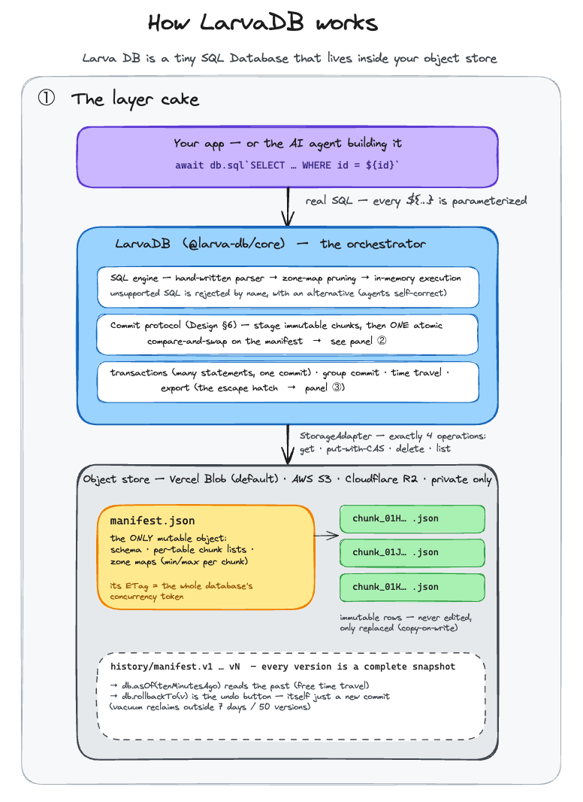
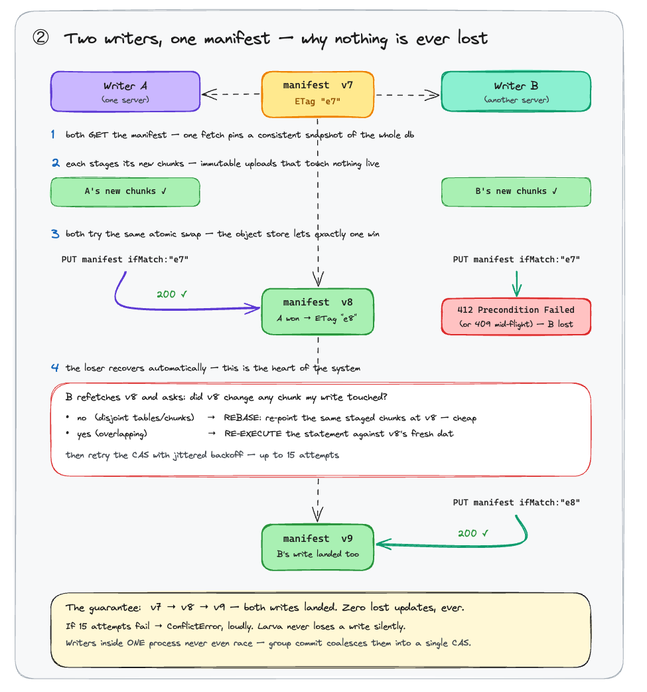
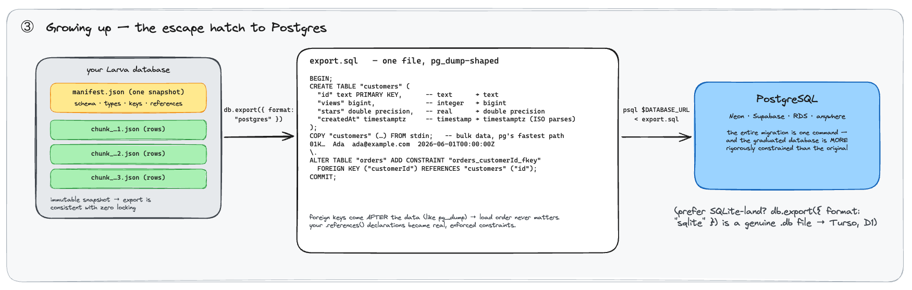

# 🐛 larvadb

**A tiny SQL database that lives inside your Vercel Blob store.** No signup, no new vendor, no server, no connection string. When your app grows up, export to a bigger database with one command — that's why it's called Larva.

[](https://github.com/pango07/larva-db/actions/workflows/ci.yml)
[](https://www.npmjs.com/package/@larva-db/core)
[](#the-testing-story)
[](packages/larvadb/src/index.ts)
[](LICENSE)

**Current release: 1.2.0.** Real SQL (time series, upserts, JSON), atomic transactions, time travel, and a guaranteed exit path to SQLite *or* Postgres.

## Sixty seconds to a database

```bash
npm install @larva-db/core
```

```ts
import { defineSchema, larva, t } from "@larva-db/core";

const schema = defineSchema({
  customers: {
    id: t.text().primaryKey(),          // ULIDs generated for you
    name: t.text(),
    email: t.text().unique(),
    createdAt: t.timestamp().partitionBy(), // ← makes date filters fast
  },
});

const db = larva({ schema }); // credentials auto-discovered from the Vercel env
```

That's the whole setup — no migrations to run, no dashboard to visit. Query it:

```ts
// ${...} values are parameterized automatically — never string-concatenated
await db.sql`INSERT INTO customers (name, email, createdAt)
             VALUES (${"Ada"}, ${"ada@example.com"}, ${"2026-06-01T00:00:00Z"})
             RETURNING *`;
// → [{ id: "01KX...", name: "Ada", email: "ada@example.com", createdAt: "2026-06-01T00:00:00Z" }]

await db.sql`SELECT name FROM customers WHERE email = ${"ada@example.com"}`;
// → [{ name: "Ada" }]
```

## What you can do with it

### Dashboard queries — time series included

```ts
// revenue by day
await db.sql`SELECT DATE(createdAt) AS day, SUM(total) AS revenue
             FROM orders
             GROUP BY DATE(createdAt)
             ORDER BY day`;
// → [{ day: "2026-07-01", revenue: 340 }, { day: "2026-07-02", revenue: 125 }, ...]

// monthly buckets, joins, HAVING — the usual dashboard shapes all work
await db.sql`SELECT customers.name, SUM(orders.total) AS revenue
             FROM orders
             INNER JOIN customers ON orders.customerId = customers.id
             GROUP BY customers.name
             HAVING revenue > ${100}
             ORDER BY revenue DESC
             LIMIT 10`;
```

### Upserts — the counter pattern

```ts
await db.sql`INSERT INTO counters (slug, count) VALUES (${"visits"}, ${1})
             ON CONFLICT (slug) DO UPDATE SET count = count + ${1}`;
```

### Sequences & composite uniques

Invoice numbers without running a server: `t.sequence()` auto-assigns integers that are unique across concurrent processes (drawn from CAS-claimed ranges, gappy on crash — exactly a Postgres sequence). Composite uniques guard pairs, and work as upsert targets:

```ts
const schema = defineSchema(
  {
    invoices: { number: t.sequence().primaryKey(), customer: t.text() },
    grants: { id: t.text().primaryKey(), userId: t.text(), feature: t.text(), level: t.integer() },
  },
  { uniques: { grants: [["userId", "feature"]] } },
);

await db.sql`INSERT INTO invoices (customer) VALUES (${"ada"}) RETURNING number`;
// → [{ number: 42 }]   — omit the column, read it back

await db.sql`INSERT INTO grants (userId, feature, level) VALUES (${"u1"}, ${"exports"}, ${2})
             ON CONFLICT (userId, feature) DO UPDATE SET level = excluded.level`;
```

### Transactions — several statements, one atomic commit

```ts
await db.transaction(async (tx) => {
  const [order] = await tx.sql`INSERT INTO orders (customerId, total)
                               VALUES (${customerId}, ${99.5}) RETURNING *`;
  await tx.sql`UPDATE inventory SET count = count - 1 WHERE sku = ${sku}`;
});
// either both happened, or neither did
```

### JSON columns (the practical way)

Store JSON with `t.text()` + `JSON.stringify`, then query inside it:

```ts
await db.sql`SELECT JSON_EXTRACT(payload, ${"$.user.name"}) AS who FROM events`;
await db.sql`SELECT payload ->> ${"status"} AS status FROM events`;
```

### The undo button

Every commit is a new immutable version. When something goes wrong — say an AI agent deleted the wrong rows — recovery is one line:

```ts
const past = await db.asOf(new Date(Date.now() - 10 * 60 * 1000)); // 10 min ago
await past.sql`SELECT COUNT(*) FROM customers`;  // peek at the past, read-only
await db.rollbackTo(past.version);               // restore it (itself undoable)
```

### The escape hatch — graduate in one command

Your data is never trapped. That's a promise, not a feature:

```ts
// → Postgres (Neon, Supabase, RDS…): one .sql file, pg_dump-shaped —
//   CREATE TABLEs with real types, data as fast COPY blocks, and your
//   .references() declarations become genuine FOREIGN KEY constraints
const sql = await db.export({ format: "postgres" });
await Bun.write("export.sql", sql);
// then:  psql $DATABASE_URL < export.sql     ← the entire migration

await db.export({ format: "sqlite" }); // a genuine .db file → Turso, D1, anywhere
await db.export({ format: "csv" });    // spreadsheets
await db.export({ format: "json" });   // everything else
await db.vacuum();                     // reclaim storage outside retention
```

### Typed rows

```ts
import type { InferRow } from "@larva-db/core";

type Customer = InferRow<typeof schema, "customers">;
// { id: string; name: string | null; email: string | null; createdAt: string | null }

const rows = await db.sql<Customer>`SELECT * FROM customers`;
```

### Any S3-compatible store

Vercel Blob is the default, but the storage contract is four operations, so the same database runs on AWS S3 or Cloudflare R2 — zero extra dependencies:

```ts
import { larva, S3Adapter } from "@larva-db/core";

const db = larva({
  schema,
  store: new S3Adapter({
    bucket: "my-bucket",
    endpoint: "https://<account>.r2.cloudflarestorage.com", // omit for AWS S3
    accessKeyId: process.env.AWS_ACCESS_KEY_ID!,
    secretAccessKey: process.env.AWS_SECRET_ACCESS_KEY!,
  }),
});
```

## Give this to your AI agent

Larva is built for apps where an agent writes the SQL. The prompt that teaches an agent the dialect, the guardrails, and the performance rules lives in **[docs/larva-for-agents.md](docs/larva-for-agents.md)** — paste its contents into your agent's instructions (CLAUDE.md, AGENTS.md, .cursorrules, a system prompt), or point the agent at a deployed test lab's **`/llms.txt`**, which serves the same file raw. The deployed lab's `/docs` page has a one-click copy button.

The short version of what it teaches:

- always interpolate with `${…}` (parameterized automatically) — never concatenate SQL
- the supported dialect, and what to do instead for everything outside it
- `UPDATE`/`DELETE` without `WHERE` needs `{ allowFullTable: true }`; multi-statement changes go in `db.transaction`
- filter on raw pk/partition columns for pruning (`createdAt >= '…'`, not `DATE(createdAt) >= '…'`)
- surface `ConflictError`, never swallow it — and `db.rollbackTo()` undoes mistakes

Errors are machine-readable on purpose — agents self-correct from specific messages:

```
UNSUPPORTED_FEATURE: subqueries are not supported in Larva v1 (found one in IN);
run the inner query first and interpolate its result
```

## Who it's for — and honest limits

Larva is for the enormous long tail of **small applications**: dashboards, internal tools, hobby apps, prototypes, and anything an AI agent is building for you. Within that envelope it promises what most "lightweight" solutions don't: **no silently lost writes, atomic multi-statement transactions, snapshot-isolated reads, and point-in-time rollback.**

The limits, stated plainly (they're physics, not configuration):

- **Storage** grows to gigabytes — that axis never runs out.
- **Writes**: every commit serializes through one compare-and-swap. Sustained throughput is roughly one commit per second (concurrent writers in the same process coalesce into shared commits); five people editing a dashboard will never notice, fifty writes per second will hit a wall.
- **Reads**: queries pull data to the compute. Filters on the primary key or the `.partitionBy()` column prune aggressively; anything else scans the table — fine at tens of thousands of rows, untenable at millions.

When you get there, congratulations: run the export and graduate — `psql $DATABASE_URL < export.sql` and you're on Postgres.

## SQL dialect

Real SQL strings, deliberately scoped: `SELECT` (with `DISTINCT`) over full expressions — arithmetic, `||` concatenation, `CASE WHEN`, `CAST`, scalar functions (`UPPER`, `LOWER`, `LENGTH`, `TRIM`, `ROUND`, `ABS`, `COALESCE`, `NULLIF`, `IFNULL`, `REPLACE`, `CEIL`, `FLOOR`, `MOD`, `SUBSTR`), date helpers (`NOW()`/`CURRENT_TIMESTAMP`, `DATE(x)`, `STRFTIME('%Y-%m', x)` — timestamps are ISO text, so this is cheap and range filters stay prunable), and JSON over text columns (`JSON_EXTRACT(col, '$.a[0]')`, `->>`); `WHERE` (`=`, `!=`, `<`, `>`, `<=`, `>=`, `AND`, `OR`, `NOT`, `IN`, `BETWEEN`, `LIKE`, `IS NULL`), `ORDER BY`, `LIMIT`/`OFFSET`, `GROUP BY` over expressions or aliases (`GROUP BY DATE(createdAt)`) with `COUNT`/`SUM`/`AVG`/`MIN`/`MAX`/`GROUP_CONCAT` (incl. `COUNT(DISTINCT …)`) and `HAVING`, two-table `INNER`/`LEFT JOIN`; `INSERT` (multi-row, `RETURNING`) with `ON CONFLICT` upsert — single-column or composite targets; `UPDATE`/`DELETE ... WHERE`; `CREATE`/`DROP TABLE`.

Not supported: subqueries, window functions, `UNION`, self-joins, 3+ table joins, `ALTER TABLE`, views, triggers. Every exclusion is rejected **by name, with an alternative**, and near-miss spellings are redirected (`CONCAT` → `||`, `SUBSTRING` → `SUBSTR`, `DATE_TRUNC` → `DATE`/`STRFTIME`).

`UPDATE`/`DELETE` without a `WHERE` clause requires an explicit `{ allowFullTable: true }` — the most common catastrophic agent mistake becomes a specific error instead.

The bar for adding to the dialect, recorded in [LARVA-DESIGN.md](LARVA-DESIGN.md) §7: agents writing conservative SQL emit it routinely, **and** it executes within the existing engine shape. Subqueries never will; `HAVING` and upsert cleared it.

## How it works

A miniaturization of the Delta Lake / Iceberg pattern, sized for object storage you already have:

- Rows live in **immutable chunk blobs**; a single small **manifest** names the current chunk set, the schema, and per-chunk min/max statistics.
- A commit stages new chunks (touching nothing live), then atomically swaps the manifest with a conditional write. Losers rebase if disjoint, re-execute if overlapping — **no lost updates, ever, or the commit fails loudly**. Writers inside one process coalesce into group commits, so same-instance concurrency never contends.
- Old manifests are complete snapshots, which is why time travel is nearly free.

The whole story in three pictures:

**The layers** — SQL goes in at the top; everything below is just files in your object store:



**Concurrency** — two writers race one compare-and-swap; the loser rebases or re-executes, and nothing is ever lost:



**Growing up** — one command out of Larva, one command into Postgres:



The editable source for these lives at [docs/larva-architecture.excalidraw](docs/larva-architecture.excalidraw) — open it at [excalidraw.com](https://excalidraw.com). The full design — including the rejected alternative, the consistency model, and three empirically-discovered object-store behaviors the adapter must handle — is in [LARVA-DESIGN.md](LARVA-DESIGN.md).

## The testing story

Correctness risk concentrates in the conflict/retry path, so that's where the tests concentrate — **168 checks across six suites**, all run in CI on every push:

| Suite | What it proves |
|---|---|
| `scripts/stress.ts` | 10 concurrent writers, 200 commits against a real store: zero lost updates, zero duplicates, exact version arithmetic |
| `scripts/property.ts` | randomized insert/update/delete workloads verified against a per-writer sequential model, tolerant of ambiguous commit outcomes |
| `scripts/sql-smoke.ts` | the full dialect + the machine-readable error catalog + pruning + time travel, live |
| `scripts/api-smoke.ts` | transaction atomicity, concurrent read-modify-write transactions, export round-trips (a real SQLite engine; Postgres DDL/COPY/FK structure), vacuum retention |
| `scripts/s3-adapter-test.ts` | the S3 adapter under an in-process fake S3 with injected 409s and 500s — chaos the engine must absorb |
| `scripts/group-commit-test.ts` | same-instance commit coalescing, batch error isolation, and the conflict matrix over the chaos-injected fake S3 |

## Development & CI

Everything runs with [Bun](https://bun.sh). The offline suites need no credentials; the live suites need a private Vercel Blob store token in `.env.local`.

```bash
bun install                        # setup (bun is the package manager)
vercel env pull .env.local         # BLOB_READ_WRITE_TOKEN, for the live suites

# fast feedback, no credentials needed
bunx tsc --noEmit                  # typecheck (includes compile-only type-inference tests)
bun run lint                       # eslint
bun scripts/s3-adapter-test.ts     # storage contract + chaos, offline
bun scripts/group-commit-test.ts   # commit coalescing + conflict matrix, offline

# live suites (real Blob store)
bun scripts/sql-smoke.ts           # the whole dialect, end to end
bun scripts/api-smoke.ts           # transactions, exports, vacuum
bun scripts/stress.ts --writers 4 --commits 6    # concurrent-writer gauntlet
bun scripts/property.ts --writers 4 --ops 10     # randomized workloads vs. model
bun scripts/bench.ts               # write-throughput benchmark (simulated latency)

bun run --cwd packages/larvadb build   # build the npm package
```

**How releases work** (`.github/workflows/ci.yml`): every push and PR runs the full test matrix. On a `main` push, the `publish` job authenticates to npm via [Trusted Publishing](https://docs.npmjs.com/trusted-publishers) (OIDC — no tokens stored anywhere) and publishes:

- if `packages/larvadb/package.json` has a **new version** → it ships as **`latest`** (that's a release: bump the version in your PR);
- otherwise → a uniquely-versioned **`canary`** (e.g. `1.0.0-canary.42.<sha>`), so every merge is installable.

## Try it in a browser

The repo doubles as a test lab — a Next.js dashboard with a SQL console over a seeded demo database (with Postgres/JSON/CSV export), a commit-protocol stress lab, and a `/docs` page that serves the agent prompt (raw at `/llms.txt`, with a copy button). [docs/test-lab.md](docs/test-lab.md) explains all of it. Deploy it to your own Vercel account:

```bash
git clone https://github.com/pango07/larva-db && cd larva-db
bun install
vercel link && vercel blob store add my-larva-store --access private --yes
bun run dev
```

## Contributing

Contributions are welcome — see [CONTRIBUTING.md](CONTRIBUTING.md) for setup, the test suites, and how releases work. The short version of the ground rules:

- Read [LARVA-DESIGN.md](LARVA-DESIGN.md) §6 before touching anything in the write path — the commit protocol is the heart of the system, and the stress/property suites are the referee.
- Chunks are immutable, conflicts fail loudly, and the public API stays small enough to fit on one screen. PRs that grow the API surface need a design-doc update in the same PR.
- New SQL features need three things: parser + executor + a named, helpful rejection message for whatever adjacent thing is still unsupported.
- Keep `LARVA-DESIGN.md` in sync — it's the spec of record, and it documents *why*, not just *what*.

**Good first issues**: additional storage adapters (Azure Blob, GCS — the contract is four operations, ~200 lines), columnar chunk format, secondary index blobs, `ALTER TABLE` with a time-travel-safe migration story.

## License

[MIT](LICENSE)
